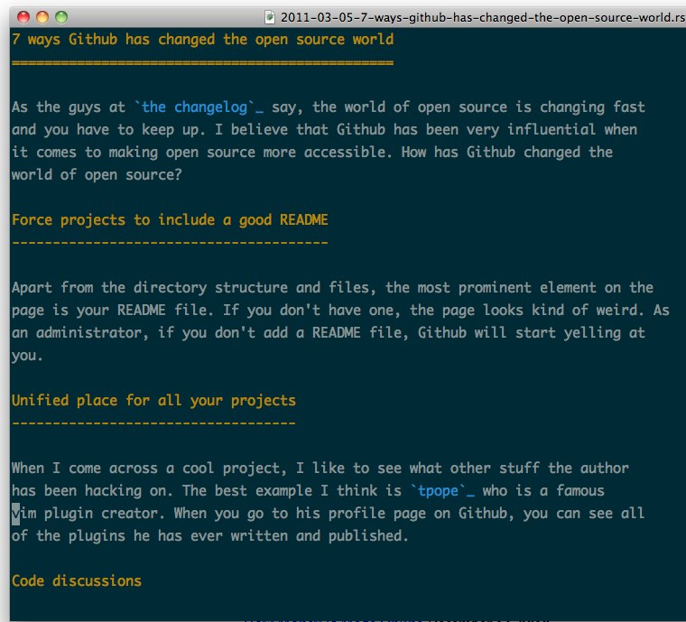

writer.vim
==========

**writer.vim** is a plugin to help you write prose in vim. It will give you a
bigger font, change it to Monaco, set the text widths to 3 alphabets (75
characters), increase the linespacing, turn off line numbers and the status
bar.

Inspired by the amazing IA Writer for Mac/iPad.

